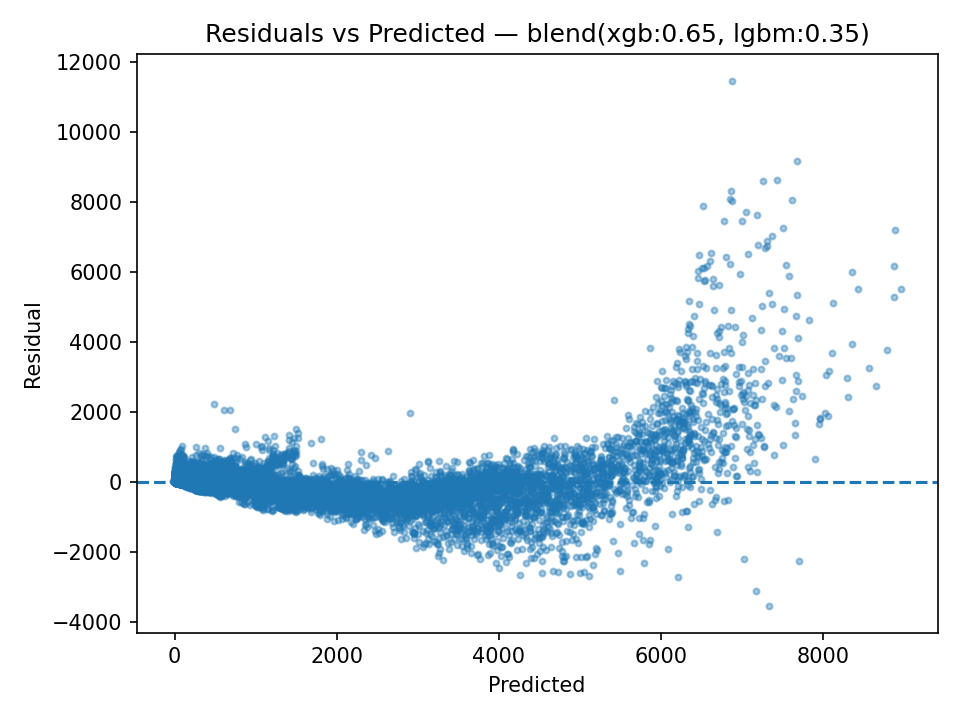
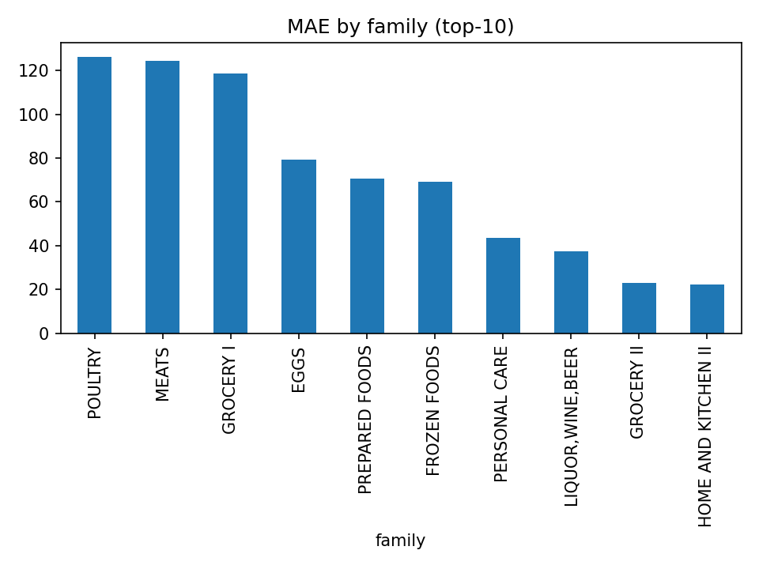
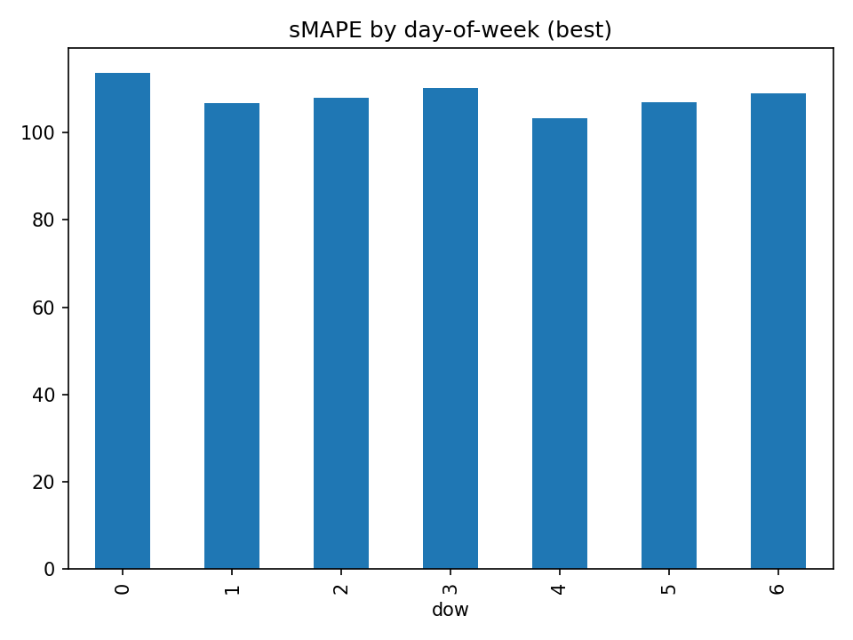

# 🏪 Favorita Store Sales Forecasting

**Goal:**  
Build a time-series forecasting model to predict daily unit sales for each product family in each store, using historical sales, promotions, and calendar data.

## 🏷️ Overview

This project tackles the Corporación Favorita Store Sales Forecasting challenge — predicting daily unit sales for thousands of product families across multiple Ecuadorian stores.
The goal was to build an end-to-end machine learning pipeline capable of modeling temporal dependencies, promotions, and holiday effects while maintaining scalability for millions of rows.

The final solution combines LightGBM and XGBoost models via simple weighted blending, achieving a holdout sMAPE of ~50.9, positioning the solution among the top-performing public submissions.


## 📊 Dataset

| Property | Description |
|-----------|--------------|
| **Source** | [Kaggle — Store Sales Time Series Forecasting](https://www.kaggle.com/competitions/store-sales-time-series-forecasting) |
| **Size** | ~3.0M records across 54 stores and 33 product families |
|Test size | ~28K rows (28 forecast days) |
| **Target Variable** | `sales` — daily unit sales for each (store, family) |

**Author:** back2daroots  
**Environment:** Python 3.11 (Conda, pip-tools), Linux/Mac  
**Core Libraries:** `pandas`, `numpy`, `scikit-learn`, `xgboost`, `optuna`, `yaml`, `matplotlib`, `seaborn`

---
## 📂 Project Structure
```
store_sales/
├── configs/
│   └── config.yaml              # Feature, model, and path settings
├── data/
│   ├── raw/                     # Original CSVs (train, test, oil, holidays, transactions)
│   └── processed/               # Processed and feature-enriched data
├── models/                      # Trained model artifacts (.joblib)
├── results/                     # Evaluation outputs and error diagnostics
├── src/
│   ├── data.py                  # Data loading and preparation
│   ├── features.py              # Feature generation and FE logic
│   ├── models.py                # Model definitions and wrappers
│   ├── metrics.py               # RMSE, MAE, sMAPE, CV utils
│   ├── logging_utils.py         # Experiment logging
│   └── utils.py                 # Helpers, validation, config parsing
├── plots/                       # Residuals, feature importance, etc
  
├── cv_run.py                    # Cross-validation runner
├── train.py                     # Train final model on full data
├── analyze_errors.py            # Post-holdout error analysis
├── experiments_log.csv          # Experiment registry
├── predict_test.py              # Create a submission file
├── blend_holdout_quick.py       # Execute blending
├── environment.yml              # Environment specification
└── .gitignore
```
---

### 1️⃣ Feature Engineering
The pipeline builds features per `(store_nbr, family)` group:
- **Lags:** 1, 7, 14, 28, 56, 84 days  
- **Rolling statistics:** mean & std over 7, 28, 56 days  
- **Promo features:** current & lagged `onpromotion`, rolling sums & means  
- **Calendar features:** day-of-week, month, year, is_weekend, month start/end  
- **Holidays:** `is_holiday`, `is_preholiday_1`, `is_postholiday_1`  
- **Interactions:** `rmean_sales_7 × onpromotion`, `is_friday × month_end`

All features are computed **causally** (using `shift(1)`), ensuring no data leakage.

---

## 🧠 Model Training

Models are defined in `src/models.py` and configured in `configs/config.yaml`.

Models experimented with:
- `XGBoostRegressor`  (hist tree method, tuned with Optuna).
- `LightGBMRegressor` (fast histogram booster).
- `CatBoostRegressor` (baseline comparison).
- `Final blend` = 0.35 * LGBM + 0.65 * XGB

Hyperparameter tuning was performed using **Optuna** with a 5-fold **time-series CV** split.

## Validation
	•	Date-based holdout split (last 28 days) + 4-fold time-based CV.
	•	Metrics: RMSE, MAE, and sMAPE (primary ranking metric).

---

## 💡 Key Insights
	•	Combining short and long rolling windows (7/28/56 days) captured both weekly and monthly trends.
	•	Promotion and holiday-related features notably improved generalization and reduced overfitting.
	•	Hierarchical (store/family) rolling means stabilized model behavior for smaller sales segments.
	•	Simple linear blending of XGB + LGBM reduced sMAPE by ~1.4 pp versus individual models.
	•	Major residuals concentrated in Beverages, Grocery I, and Cleaning families and stores 44–47.

---

## 🧪 Error Analysis (Holdout)

### 🏷️ Top-5 Product Families (by MAE)
| Family     | MAE ($) |
|-------------|---------|
| BEVERAGES   | 104.21  |
| GROCERY I   | 100.18  |
| CLEANING    |  74.97  |
| PRODUCE     |  70.75  |
| DAIRY       |  36.72  |

### 🏬 Top-4 Stores (by MAE)
| Store | MAE ($) |
|--------|----------|
| 44     |  50.41  |
| 47     |  45.55  |
| 45     |  40.71  |
| 46     |  37.70  |

### 📅 Error by Day of Week
| DOW | MAE ($) |
|------|----------|
| 6 (Sunday)   | 24.63 |
| 5 (Saturday) | 24.44 |
| 4 (Friday)   | 20.86 |
| 0 (Monday)   | 20.82 |
| 3 (Thursday) | 17.94 |
| 1 (Tuesday)  | 17.93 |
| 2 (Wednesday)| 17.78 |

---
### Model Diagnostics

**Residuals vs Predicted**


**MAE by Product Family**


**sMAPE by Day of Week**


**Feature Importance (LGBM)**


---
## 🏁 Final Results

| Model      | RMSE | MAE | sMAPE | Comment |
|-------------|------|-----|--------|----------|
| XGB         | 56.9 | 20.6 | 51.3 | Tuned baseline |
| LGBM        | 56.8 | 18.6 | 52.3 | Better alignment CV vs holdout |
| CatBoost    | 73.1 | 26.2 | 61.4 | Stable but lower |
| Blend (0.35 LGBM / 0.65 XGB) | — | — | **50.9** | Best submission |


## 🚀 How to Run

```bash
# 1. Activate environment
conda activate favorita-ts

# 2. Run CV tuning
python cv_run.py --config configs/config.yaml

# 3. Train final model
python train.py --config configs/config.yaml

# 4. Analyze errors
python analyze_errors.py --config configs/config.yaml
